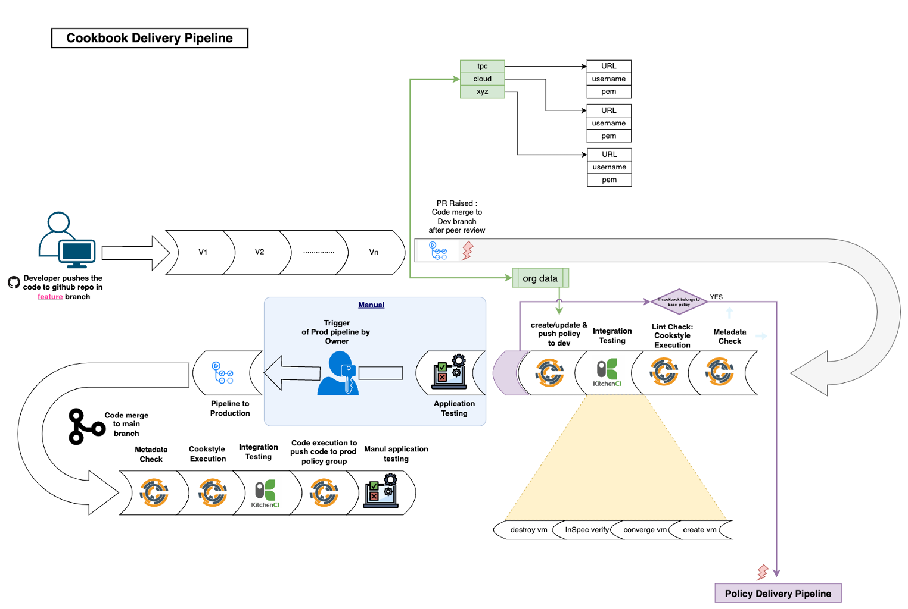
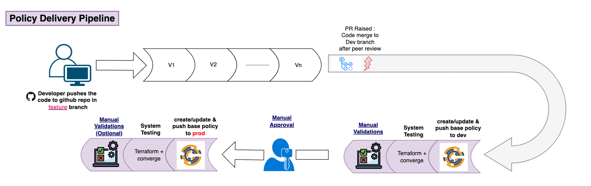
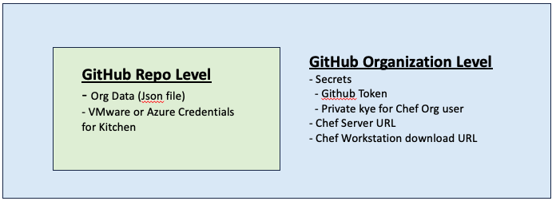

# Chef CICD Pipeline

## Pipeline Illustration

### Chef CICD Pipeline

This pipeline will be triggered whenever there is pull request opened, reopened, edited, synchronize on develop or production branch of the Repository.

- Jobs:
  - Input Validation - Checks if all the required parameters are already present.
  - Checkout Code - checks out github feature branch code for the repo.
  - Installing Workstation 
  - Linting Check - Execution of Cookstyle, which checks the linting errors in ruby files in the repository.
  - Kitchen - Kitchen Instance will be created as per the driver specified in kitchen.yml in the repository (coudl be VMware or Azure), recipes will be converged ont the new node, inspec test files under directory /test/integration/default will be exected against the converged node.
  - Policy Management - Enumerates each organization from ORG_DATA variable defined in Github Actions variables in repo creates/updates the policyfile.lock.json, and push to dev/prod branch in the Chef Server.

### Policy Pipeline

This pipeline triggered on successful exection of Chef CICD pipeline. In case the cookbook is part of the Base Policies, those will be updated/created and pushed to the Chef Server.

- Jobs:
  - Validation - Checks if the cookbook is part of base policy.
  - Instance Creation - Creates new instance on Terraform
  - Exection - Converge all the cookbooks which are member of base policyfile on the node.
  - Merge the code to dev/prod branch

## Secrets and Variables positoning

### GitHub Repo Level 

- Org data :
  Json file with information regarding Chef Organizations, at the time of development of this pipeline, there are 50 Chef Organizations, each of which is defined in json.

- Sample Json file
{
    "qa": {
        "client_name": "chefadmin",
        "client_key_name": "CHEFADMIN",
        "org_name": "qa"
    },
    "testuser": {
        "client_name": "testuser",
        "client_key_name": "TESTUSER",
        "org_name": "chef_standalone"
    }
}

- Each Object in json is a chef organizations, with following keys:
  - client_name - Name of the Chef user which must have access to install, update and push the Policyfile
  - client_key_name - Name of the private key file for client.
  - org_name - Name of the organization.

### Github Organization Level

- Secrets
  - Github Token - token for service account which must have access to merge the branch.
  - Private key for Chef Org user

> [!CAUTION]
> It is expected that all Chef Organizations have a common service account with access to install, update and push the Policyfile.lock.json to the Chef Server. All orgs must be mapped with that service account in Org Data variable.

- Chef Server URL - FQDN for Chef Server URL

- Chef Workstation Download URL - URL where chef workstation binary is kept.

